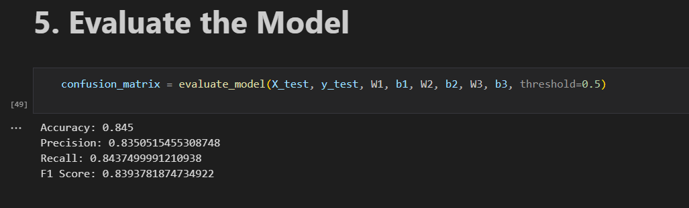

# Spam Detection Using a Feed-Forward Neural Network

This project implements a spam detection model using a two-layer feed-forward neural network. Word2Vec is used for data preprocessing, word embedding generation, and negative sampling during model training. The neural network is built to classify text messages as spam or not spam.

## Project Structure

### 1. Word2Vec Preprocessing
The `word2vec.ipynb` file handles:
- Loading and preprocessing the dataset.
- Building vocabulary and balancing the dataset.
- Initializing word embeddings.
- Generating training data and performing negative sampling.
- Saving the processed data for use in the neural network.

### 2. Neural Network for Spam Classification
The `neural_network.ipynb` file contains the core of the neural network, including:
- Loading the pre-trained embeddings and tokenized texts with labels.
- Initializing the neural network model and training over 100 epochs.
- Implementing forward and backward passes for training.
- Calculating the loss function and updating model parameters.
- Training the model and evaluating its performance.
- Visualizing the confusion matrix and classification metrics (accuracy, precision, recall, and F1 score).

## Results

### Model Evaluation
The model was evaluated based on accuracy, precision, recall, and F1 score. Below are the results:

### Confusion Matrix
The confusion matrix shows the performance of the model in classifying spam messages.

